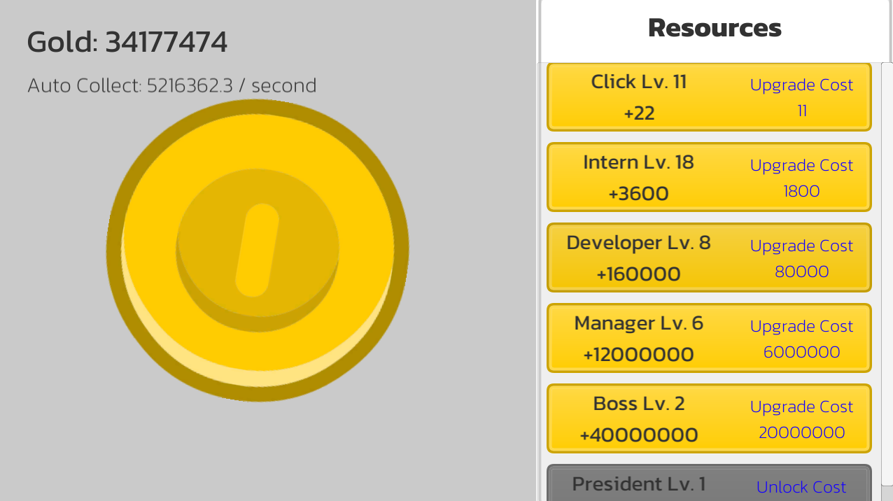

# Incremental Game

A game where player have to upgrade every resource to become rich in game. Can you become a God?

Project features:
1. Canvas UI
1. Singleton Base Class
1. Unlock and upgrade resources
1. Audio Manager

## Getting Started
1. Clone this repository to your computer/laptop
1. Open it with Unity (Recommended Unity 2020.3.9f1)
1. Play with it

## How to Install (PC)
1. Go to [Release tab](https://github.com/alfianAH/incremental-game/releases)
1. Choose between IncrementalGame_x86.exe or IncrementalGame_x64.exe. Choose the one that suits your computer/laptop. **Make sure it is the latest version.**
1. It will automatically download the file to your computer.
1. After downloading, install it by clicking on file
1. Done. You can play it now.

## Example Scene

